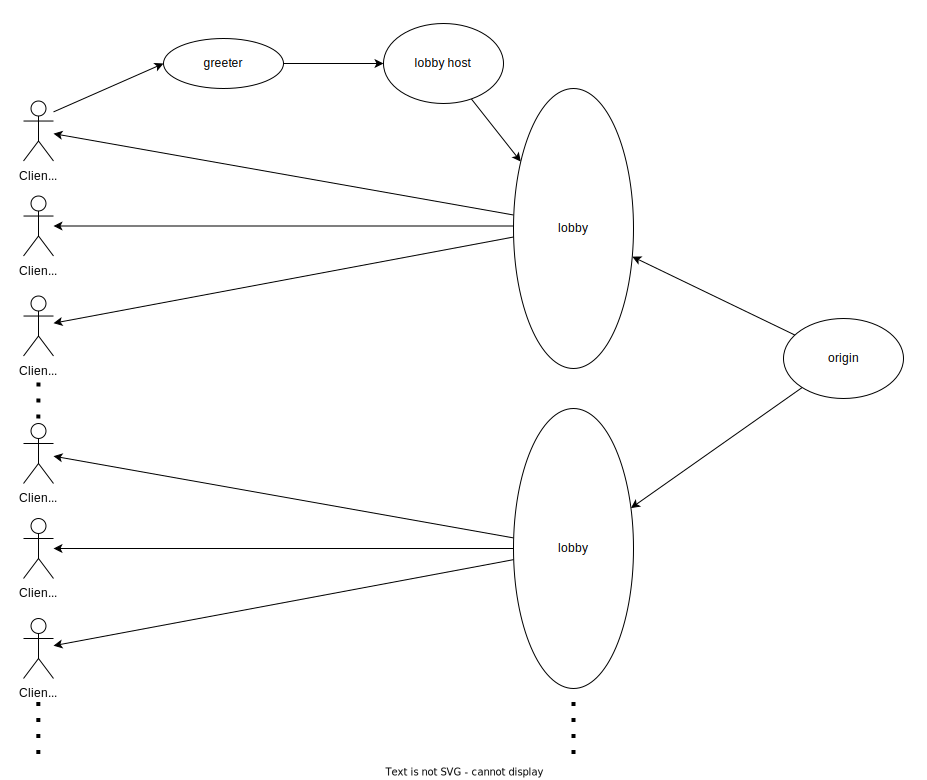

# WebSocket Gateway

The main idea is to utilize Cloudflare Workers and Durable Objects to create a WebSocket "gateway." The goal is to offload the origin by sharing a WebSocket connection among multiple clients (arbitrarily set to 512).

Consider index.mjs as the greeter, broadcastManager.mjs as the lobby host, and broadcaster.mjs as the individual lobby.

Each client goes to the greeter, and the greeter asks the lobby host for a lobby. The lobby host then queries the latest lobby it has created about the number of connected clients it has. If the lobby is full (having 512 or more clients), the lobby host creates a new lobby and returns that one. The lobby host only keeps track of the latest lobby it has created at any given moment.

MessageBus.mjs is a simple message bus that the lobby uses to send messages to all clients connected to a lobby. Client.mjs handles the call from MessageBus.mjs and keeps track of the messages, storing up to the latest 16 messages. Older messages get dropped if needed to prevent a runaway scenario. The messages in each client's queue are processed asynchronously as fast as possible. With this approach, a slow client will never slow down the others.

The basic idea seems to work, but there are some issues:

- Connection to the origin server has no error handling. If the origin server goes down, the connection is not re-established.
- There is no real protection against runaway lobbies. If a lobby gets filled, it will continue to exist as long as a client is connected. This means you could end up with many lobbies that only have a very low number of clients connected to them.
- There is never any cleanup of lobbies. If all clients disconnect, the lobby will disconnect from the origin, but makes no attempt at destroying itself.. However, Cloudflare claims to automatically evict Durable Objects that are idle, so this may not be an issue.
- This code was written with the help of AI, so it's probably full of bugs.
- The broadcasterManager does not have any code for handling the case where the referenced broadcaster is evicted. This should not be an issue though, as Cloudflare claims to automatically create a new Durable Object if the previous one with the same ID is evicted.

> I stopped working on this project as soon as I became aware of how Cloudflare bills Durable Objects and WebSockets. Some napkin math suggests that this would cost around $15 per month to sustain a lobby with 30 clients. It doesn't make sense to use this in an attempt to save money, as using that money to buy a more powerful server would provide better value.

## How to Use

1. Configure wrangler.toml
2. Test with `wrangler dev`
3. Deploy with `wrangler publish`
4. Pay the substantial bills that will arrive in the mail
